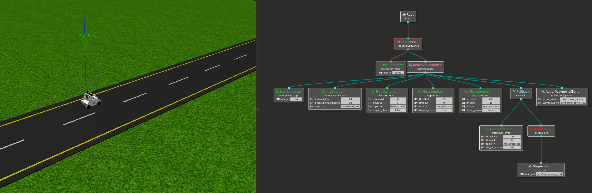

# UGV Decision Manager

`ugv_decision_manager` is a ROS-based metapackage designed for autonomous decision-making in unmanned ground vehicles (UGV). It uses Behavior Trees (BT) to orchestrate navigation, mission execution, and safety systems.




This package includes custom BT nodes, a Pure Pursuit controller (modified from [Polaris GEM e2 Simulator](https://gitlab.engr.illinois.edu/gemillins/POLARIS_GEM_e2/-/tree/main/)), and utilities for waypoint management and mock sensors.

The code was developed in Ubuntu 20.04 with ROS Noetic.

**Author**: Matheus Henrique Nunes França
**Contact**: br_matheus@hotmail.com

## Repository Structure

The repository was structured to leverage BehaviorTree.CPP v3 for managing robot behavior efficiently and modularly.

- **ugv_bt_interfaces**: Contains ROS message and action definitions for waypoint handling.
- **ugv_bt_manager**: Core package managing the behavior tree execution, including BT definitions, custom BT nodes, launch files, and tests.
- **ugv_pure_pursuit_controller**: Implements a Pure Pursuit path-following controller using ROS actions.

## Installation and Running Docker

To simplify installation and execution, a Dockerfile is provided:

```bash
git clone https://github.com/MatheusFranca-dev/ugv_decision_manager.git
cd ugv_decision_manager
docker build -t ugv_decision_manager:latest .
```

```bash
docker run --name ugv_decision_manager \
    --gpus all \
    --network host \
    --env=DISPLAY \
    --env=NVIDIA_DRIVER_CAPABILITIES=all \
    --env=NVIDIA-VISIBLE_DEVICES=all \
    --env=QT_X11_NO_MITSHM=1 \
    -v /tmp/.X11-unix:/tmp/.X11-unix:rw \
    --runtime=nvidia \
    --privileged \
    -it ugv_decision_manager:latest
```

```bash
docker exec -it ugv_decision_manager /bin/bash
```

## Running the System

- **Behavior Tree and Sensor Simulation**:

```bash
roslaunch ugv_bt_manager ugv_bringup.launch
```

- **Mock Sensors Publisher**:

```bash
roslaunch ugv_bt_manager mock_sensors_pub.launch test_scenario:=1
```

---

## Behavior Tree Organization

The behavior tree uses a reactive sequence to manage the robot's responses dynamically based on sensor data. Key nodes included:

### Actions

- **ActionWaypointClient.hpp**: Sends waypoint action goals to Pure Pursuit controller.
- **StopAction.hpp**: Publishes a stop command to halt vehicle movement.

### Conditions

- **BoolCondition.hpp**: Checks boolean sensor conditions.
- **FloatCondition.hpp**: Checks floating-point sensor values.
- **IntCondition.hpp**: Checks integer sensor conditions.

A fallback node with an unnecessary action (`StopAction`) was also included to demonstrate additional BT capabilities and modularity. This was specifically chosen to show how additional behaviors could easily be integrated through the BT. The `StopAction` is redundant in this implementation since the controller already includes a built-in mechanism for stopping the vehicle, but it serves as an example of BT's flexibility and extensibility.

---

## Interfaces

- **Waypoint.msg**: Defines the structure of a waypoint message (`x`, `y`, `yaw`).
- **Waypoint.action**: Defines an action for waypoint navigation, accepting an array of waypoints.

---

## Pure Pursuit Controller

Implements a Pure Pursuit algorithm for Ackermann-steered vehicles, interfacing via ROS actions. It includes:

- Action server for receiving waypoints.
- Calculation and publication of crosstrack error.
- Vehicle control through AckermannDrive commands.

The decision-making system was carefully designed to use ROS actions to interface with the controller, ensuring easy modularity. If a different path-tracking controller needs to be implemented, only the controller client block in the BT needs to be modified. This modularity simplifies integrating different controllers with their specific interfaces.

---

## Difficulties Encountered

During development, some challenges were encountered:

- **ROS gtest Topic Conflicts**: Initial tests using `gtest` exhibited conflicts due to overlapping topic names. This was resolved by ensuring unique topic names, preventing interference between tests.
- **ROS Service vs. Action**: Initially, a ROS service was utilized for the controller interface. However, due to the lack of feedback from services, transitioning to a ROS Action interface was necessary to provide feedback to the Behavior Tree, significantly improving the robustness and responsiveness of the system.
- **Integration Complexity**: Integrating diverse sensor data into the Behavior Tree required careful synchronization, especially when multiple conditions could trigger simultaneous state transitions.

### Response Times
- **Sensor-triggered State Changes**: Average response times for sensor-triggered state transitions were consistently below 500ms, meeting good requirements for safe UGV operations.

### Robustness Analysis
- **Varied Failure Scenarios**: The Behavior Tree exhibited robust performance under diverse fault conditions: estop error, battery fault, temperature increase, GPS accuracy drops, network disruptions, and controller error. The BT seamlessly transit to ERROR states to maintain vehicle safety. While in FAILURE or RUNNING states, the tree halts further execution until all safety conditions are satisfied, only concluding with SUCCESS when mission objectives are fully achieved.

### Recovery Time Evaluation
- **Recovery from Error States**: The system exhibited quick recovery capabilities, typically restoring normal operation within ~1 second after the resolution of sensor-triggered errors, thus ensuring minimal operational downtime.

These analyses confirm that the `ugv_decision_manager` maintains reliable performance across critical operational scenarios, aligning with safety and efficiency objectives.

## References

The design and implementation were informed by the following references:

- [FKIE Behavior Trees](https://github.com/fkie/fkie_behavior_trees/blob/main/README.md)
- [BehaviorTree.CPP](https://www.behaviortree.dev/)
- [ROS Noetic Documentation](http://wiki.ros.org/noetic)

## License

Refer to the [LICENSE](LICENSE) file in this repository.

## Bugs & Feature Requests

Please report bugs and request features using the [Issue Tracker](https://github.com/MatheusFranca-dev/ugv_decision_manager/issues).
